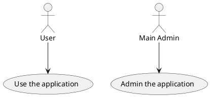
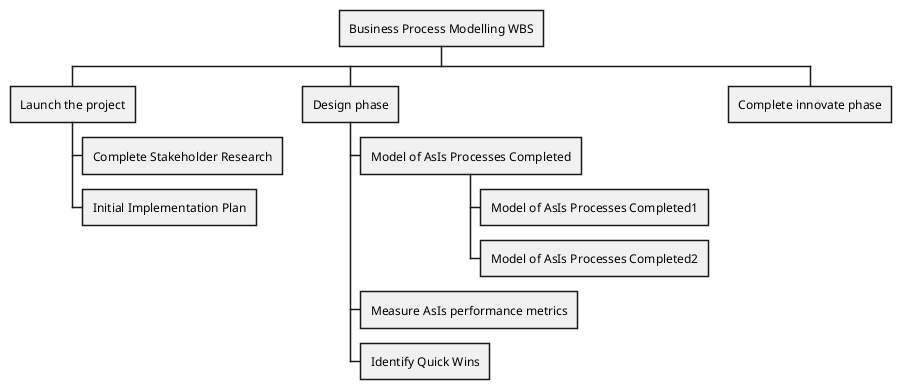

# Project Basis

- copy/paste inside the _new_structure_directory each script on its respective folder
- get the content of the _new_structure_ directory and put it in the root directory
- Delete the .idea folder
- create a .gitignore
- Reestructure the project
  - Create directory folder structure
  - Move scripts to the folders
- Create installation script in the parent folder (A script that - installs the other scripts in the system)
- Create a proper README.md file
- Branching strategy
- Templates:
    - Documentation
    - Parse arguments
    - Documentation shown with man command
    - Script template
- Complete the TODOs for each script

# Scripts TODOs

## install_java.sh

- man documentation
- Header
- parse arguments & show error
- include external references ???
- create functions 
- clean obsolete code
- redo the article InstallOpenJDKInUbuntu.md

## mute_ms_teams.sh

- man documentation
- Header
- 

## create_directory_structure.sh

## linux_setup.sh

## ubuntu_setup.sh

# TODOs for the future

 - https://stackoverflow.com/questions/59895/how-to-get-the-source-directory-of-a-bash-script-from-within-the-script-itself
 - https://stackoverflow.com/questions/1371261/get-current-directory-name-without-full-path-in-a-bash-script
 - https://stackoverflow.com/questions/6482377/check-existence-of-input-argument-in-a-bash-shell-script

 # Enrich the documentation with plantuml diagrams

Below you have some examples:

Source:
 - [Diagrams with plantuml](https://blog.anoff.io/2018-07-31-diagrams-with-plantuml/)